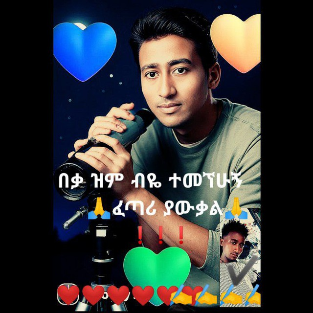

# 📝 Complete Source Code Reference

This file contains all the key source code files for the Netsanet Portfolio project.

## Table of Contents
1. [Configuration Files](#configuration-files)
2. [React Components](#react-components)
3. [Styles & Animations](#styles--animations)
4. [PHP Backend](#php-backend)

---

## Configuration Files

### tailwind.config.js
```javascript
/** @type {import('tailwindcss').Config} */
export default {
  content: [
    "./index.html",
    "./src/**/*.{js,ts,jsx,tsx}",
  ],
  theme: {
    extend: {
      colors: {
        primary: '#1F2937',
        secondary: '#9CA3AF',
        accent: '#3B82F6',
        success: '#10B981',
        warning: '#F59E0B',
        danger: '#EF4444',
      },
      animation: {
        'slide-in': 'slideIn 0.8s ease-out',
        'fade-in': 'fadeIn 0.6s ease-out',
        'bounce-slow': 'bounce 2s infinite',
        'pulse-slow': 'pulse 3s cubic-bezier(0.4, 0, 0.6, 1) infinite',
        'shimmer': 'shimmer 2s infinite',
        'float': 'float 6s ease-in-out infinite',
        'glow': 'glow 2s ease-in-out infinite',
        'wave': 'wave 1.5s ease-in-out infinite',
      },
      keyframes: {
        slideIn: {
          '0%': { transform: 'translateX(-100%)', opacity: '0' },
          '100%': { transform: 'translateX(0)', opacity: '1' },
        },
        fadeIn: {
          '0%': { opacity: '0' },
          '100%': { opacity: '1' },
        },
        shimmer: {
          '0%': { backgroundPosition: '-1000px 0' },
          '100%': { backgroundPosition: '1000px 0' },
        },
        float: {
          '0%, 100%': { transform: 'translateY(0px)' },
          '50%': { transform: 'translateY(-20px)' },
        },
        glow: {
          '0%, 100%': { boxShadow: '0 0 5px rgba(59, 130, 246, 0.5)' },
          '50%': { boxShadow: '0 0 20px rgba(59, 130, 246, 1)' },
        },
        wave: {
          '0%, 100%': { transform: 'translateY(0px)' },
          '50%': { transform: 'translateY(-10px)' },
        },
      },
    },
  },
  plugins: [],
}
```

### postcss.config.js
```javascript
module.exports = {
  plugins: [
    require('tailwindcss'),
    require('autoprefixer'),
  ],
}
```

---

## React Components

### Navbar Component (src/components/Navbar/Navbar.tsx)

```typescript
import React, { useState, useEffect } from 'react';

interface NavbarProps {
  className?: string;
}

const Navbar: React.FC<NavbarProps> = ({ className }) => {
  const [isMobileMenuOpen, setIsMobileMenuOpen] = useState(false);
  const [isScrolled, setIsScrolled] = useState(false);
  const [searchQuery, setSearchQuery] = useState('');
  const [isSearchOpen, setIsSearchOpen] = useState(false);

  useEffect(() => {
    const handleScroll = () => {
      setIsScrolled(window.scrollY > 50);
    };
    window.addEventListener('scroll', handleScroll);
    return () => window.removeEventListener('scroll', handleScroll);
  }, []);

  useEffect(() => {
    const handleClickOutside = (event: MouseEvent) => {
      const target = event.target as Element;
      if (isMobileMenuOpen && !target.closest('.navbar-container')) {
        setIsMobileMenuOpen(false);
      }
    };
    document.addEventListener('click', handleClickOutside);
    return () => document.removeEventListener('click', handleClickOutside);
  }, [isMobileMenuOpen]);

  const toggleMobileMenu = () => {
    setIsMobileMenuOpen(!isMobileMenuOpen);
  };

  const handleNavClick = (sectionId: string) => {
    setIsMobileMenuOpen(false);
    setIsSearchOpen(false);
    const element = document.getElementById(sectionId);
    if (element) {
      element.scrollIntoView({ behavior: 'smooth', block: 'start' });
    }
  };

  const handleSearch = (e: React.FormEvent) => {
    e.preventDefault();
    if (searchQuery.trim()) {
      const searchTerm = searchQuery.toLowerCase();
      const sections = ['about', 'projects', 'skills', 'experience', 'gallery', 'contact'];
      
      for (const section of sections) {
        const element = document.getElementById(section);
        if (element) {
          const text = element.textContent?.toLowerCase() || '';
          if (text.includes(searchTerm)) {
            handleNavClick(section);
            break;
          }
        }
      }
    }
  };

  const toggleSearch = () => {
    setIsSearchOpen(!isSearchOpen);
    if (!isSearchOpen) {
      setTimeout(() => {
        document.getElementById('search-input')?.focus();
      }, 100);
    }
  };

  const navItems = [
    { id: 'hero', label: 'Home' },
    { id: 'about', label: 'About' },
    { id: 'projects', label: 'Projects' },
    { id: 'contact', label: 'Contact' }
  ];

  return (
    <nav 
      className={`navbar-container fixed top-0 w-full z-50 transition-all duration-300 ${
        isScrolled 
          ? 'bg-white shadow-lg' 
          : 'bg-gradient-to-b from-gray-900/90 to-transparent'
      } ${className || ''}`}
    >
      <div className="max-w-7xl mx-auto px-4 sm:px-6 lg:px-8">
        <div className="flex justify-between items-center h-16">
          {/* Logo/Brand */}
          <div className="flex-shrink-0">
            <button
              onClick={() => handleNavClick('hero')}
              className="text-2xl font-bold bg-gradient-to-r from-blue-400 via-blue-500 to-blue-600 bg-clip-text text-transparent hover:opacity-80 transition-opacity"
            >
              Netsanet
            </button>
          </div>

          {/* Desktop Navigation */}
          <div className="hidden md:flex items-center space-x-1">
            {navItems.map((item) => (
              <button
                key={item.id}
                onClick={() => handleNavClick(item.id)}
                className={`px-3 py-2 rounded-md text-sm font-medium transition-all duration-200 ${
                  isScrolled
                    ? 'text-gray-700 hover:text-blue-500 hover:bg-gray-100'
                    : 'text-white hover:text-blue-300 hover:bg-white/10'
                }`}
              >
                {item.label}
              </button>
            ))}
          </div>

          {/* Search Bar - Desktop */}
          <div className="hidden md:flex items-center space-x-4">
            <form onSubmit={handleSearch} className="flex items-center">
              <input
                type="text"
                placeholder="Search..."
                value={searchQuery}
                onChange={(e) => setSearchQuery(e.target.value)}
                className={`px-4 py-2 rounded-lg text-sm transition-all ${
                  isScrolled
                    ? 'bg-gray-200 text-gray-800 placeholder-gray-500'
                    : 'bg-white/10 text-white placeholder-white/50'
                } focus:outline-none focus:ring-2 focus:ring-blue-500`}
              />
              <button
                type="submit"
                className={`ml-2 px-4 py-2 rounded-lg font-medium transition-all ${
                  isScrolled
                    ? 'bg-blue-500 text-white hover:bg-blue-600'
                    : 'bg-blue-500 text-white hover:bg-blue-600'
                }`}
              >
                Search
              </button>
            </form>
          </div>

          {/* Mobile menu button and Search icon */}
          <div className="md:hidden flex items-center space-x-2">
            <button
              onClick={toggleSearch}
              className={`p-2 rounded-md transition-colors ${
                isScrolled
                  ? 'text-gray-700 hover:bg-gray-200'
                  : 'text-white hover:bg-white/10'
              }`}
            >
              🔍
            </button>
            
            <button
              onClick={toggleMobileMenu}
              className={`p-2 rounded-md transition-colors ${
                isScrolled
                  ? 'text-gray-700 hover:bg-gray-200'
                  : 'text-white hover:bg-white/10'
              }`}
            >
              <svg
                className="h-6 w-6"
                fill="none"
                stroke="currentColor"
                viewBox="0 0 24 24"
              >
                <path
                  strokeLinecap="round"
                  strokeLinejoin="round"
                  strokeWidth={2}
                  d={isMobileMenuOpen ? 'M6 18L18 6M6 6l12 12' : 'M4 6h16M4 12h16M4 18h16'}
                />
              </svg>
            </button>
          </div>
        </div>

        {/* Mobile Search Bar */}
        {isSearchOpen && (
          <div className="md:hidden pb-4 animate-slideIn">
            <form onSubmit={handleSearch} className="flex flex-col space-y-2">
              <input
                id="search-input"
                type="text"
                placeholder="Search..."
                value={searchQuery}
                onChange={(e) => setSearchQuery(e.target.value)}
                className="w-full px-4 py-2 rounded-lg text-sm bg-gray-200 text-gray-800 placeholder-gray-500 focus:outline-none focus:ring-2 focus:ring-blue-500"
              />
              <button
                type="submit"
                className="w-full px-4 py-2 rounded-lg font-medium bg-blue-500 text-white hover:bg-blue-600 transition-colors"
              >
                Search
              </button>
            </form>
          </div>
        )}

        {/* Mobile Navigation Menu */}
        {isMobileMenuOpen && (
          <div className="md:hidden pb-4 space-y-2 animate-slideIn">
            {navItems.map((item) => (
              <button
                key={item.id}
                onClick={() => handleNavClick(item.id)}
                className={`block w-full text-left px-3 py-2 rounded-md text-base font-medium transition-all ${
                  isScrolled
                    ? 'text-gray-700 hover:text-blue-500 hover:bg-gray-100'
                    : 'text-white hover:text-blue-300 hover:bg-white/10'
                }`}
              >
                {item.label}
              </button>
            ))}
          </div>
        )}
      </div>
    </nav>
  );
};

export default Navbar;
```

### Home Component (src/components/Home/Home.tsx) - Key Sections

```typescript
// Profile Image with Float Animation


// Animated Name with Gradient and Glow
<h1 
  id="hero-title"
  className="text-4xl md:text-6xl font-bold mb-4 animated-name glow"
>
  Netsanet Worku
</h1>

// Wave Animation on Greeting
<h2 className="text-lg md:text-xl font-semibold text-blue-400 mb-2 animate-wave">
  Hello, I'm
</h2>
```

---

## Styles & Animations

### Global Styles (src/styles/global.scss) - Key Sections

```scss
/* Animated Name */
.animated-name {
  display: inline-block;
  background: linear-gradient(45deg, #3B82F6, #1D4ED8, #3B82F6);
  background-size: 300% 300%;
  -webkit-background-clip: text;
  -webkit-text-fill-color: transparent;
  background-clip: text;
  animation: gradientShift 3s ease infinite;
  font-weight: 700;
  letter-spacing: -0.02em;
}

.animated-name.glow {
  animation: glow 2s ease-in-out infinite, gradientShift 3s ease infinite;
}

/* Gradient Shift Animation */
@keyframes gradientShift {
  0% {
    background-position: 0% 50%;
  }
  50% {
    background-position: 100% 50%;
  }
  100% {
    background-position: 0% 50%;
  }
}

/* Glow Animation */
@keyframes glow {
  0%, 100% {
    text-shadow: 0 0 10px rgba(59, 130, 246, 0.5);
  }
  50% {
    text-shadow: 0 0 20px rgba(59, 130, 246, 1);
  }
}

/* Float Animation */
@keyframes float {
  0%, 100% {
    transform: translateY(0px);
  }
  50% {
    transform: translateY(-20px);
  }
}

/* Wave Animation */
@keyframes wave {
  0%, 100% {
    transform: translateY(0px);
  }
  50% {
    transform: translateY(-10px);
  }
}
```

---

## PHP Backend

### backend/api.php

```php
<?php
// Enable CORS
header('Access-Control-Allow-Origin: *');
header('Access-Control-Allow-Methods: GET, POST, OPTIONS');
header('Access-Control-Allow-Headers: Content-Type');
header('Content-Type: application/json');

if ($_SERVER['REQUEST_METHOD'] === 'OPTIONS') {
    http_response_code(200);
    exit();
}

$request_uri = parse_url($_SERVER['REQUEST_URI'], PHP_URL_PATH);
$route = basename($request_uri);

switch ($route) {
    case 'contact':
        if ($_SERVER['REQUEST_METHOD'] === 'POST') {
            handleContactForm();
        }
        break;
    
    case 'portfolio':
        if ($_SERVER['REQUEST_METHOD'] === 'GET') {
            getPortfolioData();
        }
        break;
    
    case 'projects':
        if ($_SERVER['REQUEST_METHOD'] === 'GET') {
            getProjects();
        }
        break;
    
    case 'skills':
        if ($_SERVER['REQUEST_METHOD'] === 'GET') {
            getSkills();
        }
        break;
    
    default:
        http_response_code(404);
        echo json_encode(['error' => 'Endpoint not found']);
        break;
}

function handleContactForm() {
    $input = json_decode(file_get_contents('php://input'), true);
    
    if (!isset($input['name']) || !isset($input['email']) || !isset($input['message'])) {
        http_response_code(400);
        echo json_encode(['error' => 'Missing required fields']);
        return;
    }
    
    $name = sanitizeInput($input['name']);
    $email = sanitizeInput($input['email']);
    $message = sanitizeInput($input['message']);
    
    if (!filter_var($email, FILTER_VALIDATE_EMAIL)) {
        http_response_code(400);
        echo json_encode(['error' => 'Invalid email address']);
        return;
    }
    
    $contact_data = [
        'name' => $name,
        'email' => $email,
        'message' => $message,
        'timestamp' => date('Y-m-d H:i:s'),
        'ip' => $_SERVER['REMOTE_ADDR']
    ];
    
    $logFile = 'contact_log.json';
    $contacts = file_exists($logFile) ? json_decode(file_get_contents($logFile), true) : [];
    $contacts[] = $contact_data;
    file_put_contents($logFile, json_encode($contacts, JSON_PRETTY_PRINT));
    
    http_response_code(200);
    echo json_encode([
        'success' => true,
        'message' => 'Your message has been sent successfully!',
        'data' => $contact_data
    ]);
}

function getPortfolioData() {
    $portfolio = [
        'name' => 'Netsanet Worku',
        'title' => 'Full-Stack Developer',
        'university' => 'Madda Walabu University',
        'year' => 'Third Year',
        'field' => 'Computer Science',
        'bio' => 'Passionate web developer with expertise in HTML, CSS, JavaScript, React, and PHP',
        'location' => 'Asela, Ethiopia',
        'social' => [
            'tiktok' => 'https://tiktok.com/@netsanet.worku',
            'telegram' => 'https://t.me/Abi_yam21',
            'github' => 'https://github.com/NetsanetWorku'
        ]
    ];
    
    echo json_encode($portfolio);
}

function getProjects() {
    $projects = [
        [
            'id' => 1,
            'title' => 'Personal Portfolio',
            'description' => 'A modern, responsive portfolio website built with React and Tailwind CSS',
            'technologies' => ['React', 'TypeScript', 'Tailwind CSS', 'JavaScript'],
            'link' => 'https://netsanet.portfolio.com',
        ],
        // ... more projects
    ];
    
    echo json_encode($projects);
}

function getSkills() {
    $skills = [
        'Frontend' => ['HTML', 'CSS', 'JavaScript', 'React', 'TypeScript', 'Tailwind CSS', 'SCSS'],
        'Backend' => ['PHP', 'Node.js', 'Express', 'REST APIs'],
        'Database' => ['MySQL', 'MongoDB', 'Firebase'],
        'Tools' => ['Git', 'Docker', 'Vite', 'Webpack', 'npm', 'Yarn']
    ];
    
    echo json_encode($skills);
}

function sanitizeInput($input) {
    return htmlspecialchars(trim($input), ENT_QUOTES, 'UTF-8');
}
?>
```

---

## Summary

This portfolio project now includes:

✅ **React Components**
- Modern Navbar with search
- Enhanced Home hero section
- Responsive design

✅ **CSS & Animations**
- Tailwind CSS for styling
- Animated gradient name
- Glow effect
- Float, wave, and fade animations

✅ **Backend API**
- PHP REST API
- Contact form handling
- Portfolio data endpoints

✅ **Technologies**
- React 18 + TypeScript
- Tailwind CSS 3.4
- SCSS Modules
- PHP 8+
- Vite

See `QUICK_START.md` and `COMPLETE_CODE_GUIDE.md` for detailed instructions.
